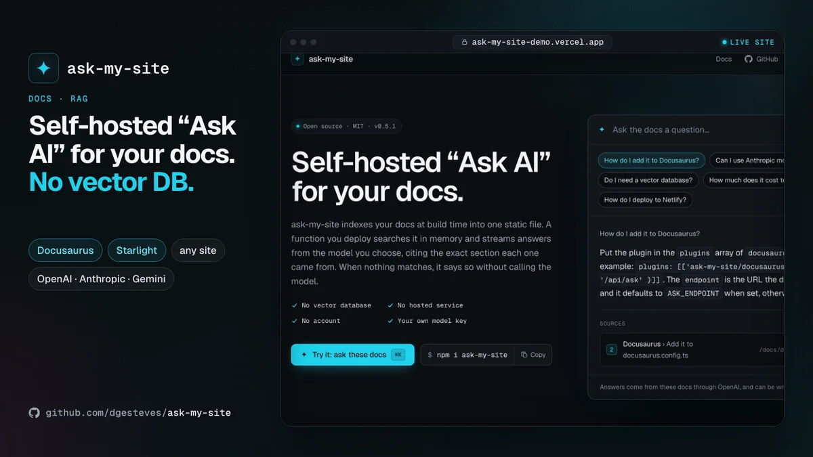

# ask-my-site

**Make your docs answerable by people and by agents, from one static index: a cited Ask box, an MCP server and llms.txt, on your own function and key, with no vector database and no vendor. Agent traffic costs you no model tokens.**

[](https://github.com/dgesteves/ask-my-site/actions/workflows/ci.yml)
[](https://www.npmjs.com/package/ask-my-site)
[](./LICENSE)
[](https://ask-my-site-demo.vercel.app/docs/api)

**Website: [ask-my-site-demo.vercel.app](https://ask-my-site-demo.vercel.app)**, whose [docs](https://ask-my-site-demo.vercel.app/docs) answer questions about this library with OpenAI, under a rate limit and a daily budget, and serve agents at `/api/mcp`.

<!-- npm-readme:video -->

https://github.com/user-attachments/assets/a6cc9565-cdee-4654-8616-be30ae4d7a8b

<sub>The <a href="https://ask-my-site-demo.vercel.app">live demo</a>: a question, a streamed answer with citations, and a citation opening the section it came from. On that docs page, the Ask button answers a setup question with the exact config. Then the one-line setup for Docusaurus, Starlight and any other site.</sub>

<!-- npm-readme:image
<p align="center">
  <a href="https://ask-my-site-demo.vercel.app"></a>
</p>

<sub>The <a href="https://ask-my-site-demo.vercel.app">live demo</a>: a question, a streamed answer with citations, and a citation opening the section it came from. On that docs page, the Ask button answers a setup question with the exact config. Then the one-line setup for Docusaurus, Starlight and any other site.</sub>
-->

## What you get

One index, `ask-index.json`, built with your site from the pages it serves, feeds three things:

- **An Ask box for people.** A ⌘K dialog that streams a short answer from your model, with numbered citations to the exact section. When nothing relevant is found, it says "I don't know" without calling the model. A page carries only its button, a few KB of JavaScript; the dialog loads the first time it is wanted.
- **An MCP server for agents.** `search`, `fetch` and `list_pages` over the same index, for Claude Code, Cursor, VS Code, ChatGPT and Claude. The agent brings its own model, and search is keyword-only by default, so it calls no model at all.
- **`llms.txt`, `llms-full.txt` and a `.md` copy of every page**, written with the build.

Search runs in memory inside one function you deploy: BM25 and vectors, merged with reciprocal rank fusion. There is no vector database, no hosted service and no account. MIT licensed.

## Pick your setup

| Your site                          | What you add                | Guide                                                                 |
| ---------------------------------- | --------------------------- | --------------------------------------------------------------------- |
| Docusaurus 3                       | A plugin                    | [Docusaurus](https://ask-my-site-demo.vercel.app/docs/docusaurus)     |
| Starlight, or any Astro site       | A plugin, or an integration | [Astro and Starlight](https://ask-my-site-demo.vercel.app/docs/astro) |
| Next.js or another React app       | A route and a component     | [Next.js and React](https://ask-my-site-demo.vercel.app/docs/nextjs)  |
| Hugo, Jekyll, MkDocs or plain HTML | One script tag              | [Script tag](https://ask-my-site-demo.vercel.app/docs/script-tag)     |

Each answers from an endpoint you deploy as one function next to the site, rate-limited by default. `npx ask-my-site init` writes it for Vercel, Netlify, Cloudflare or GitHub Pages (as a Cloudflare Worker of its own), and an Astro site with an SSR adapter needs none: see [Deploying](https://ask-my-site-demo.vercel.app/docs/deployment).

**Docusaurus.** `npm i ask-my-site ai @ai-sdk/openai @radix-ui/react-dialog cmdk`, then:

```ts
// docusaurus.config.ts
export default { plugins: ['ask-my-site/docusaurus'] };
```

After `docusaurus build`, it indexes the pages into `build/ask-index.json`, writes `llms.txt` and the `.md` pages, and adds an "Ask AI" button with ⌘I.

**Starlight.** `npm i ask-my-site ai @ai-sdk/openai react react-dom @radix-ui/react-dialog cmdk`, then:

```js
// astro.config.mjs
integrations: [starlight({ title: 'Acme Docs', plugins: [askMySite()] })],
```

**Next.js.** With `OPENAI_API_KEY` set, index your content with `npx ask-my-site index ./content --base-url /docs`, then:

```ts
// app/api/ask/route.ts
export const POST = createAskHandler({
  index,
  model: openai('gpt-5.4-mini'),
  embeddingModel: openai.embedding('text-embedding-3-small'),
});
```

and render `<AskDialog launcher />` from `ask-my-site/react` in your layout.

**Any other site.** Index the HTML it builds (`npx ask-my-site index public`), write the endpoint with `npx ask-my-site init`, and add:

```html
<script src="https://cdn.jsdelivr.net/npm/ask-my-site@0.6/dist/embed.global.js" defer></script>
```

**Try it without a key.** `npx ask-my-site index ./docs -e mock`, then `npx ask-my-site dev`, serves the ask endpoint and the MCP server on localhost, with offline embeddings and a mock model that quotes your docs. See [Try it locally](https://ask-my-site-demo.vercel.app/docs/local-development).

## For agents

The same index, served to agents with `createMcpHandler`:

```ts
// app/api/mcp/route.ts
const handler = createMcpHandler({ index, siteName: 'the Acme docs' });
export { handler as POST, handler as GET, handler as DELETE, handler as OPTIONS };
```

```sh
claude mcp add --transport http acme-docs https://docs.acme.dev/api/mcp
```

- **Protocol.** MCP 2026-07-28 (stateless, `server/discover`), and for clients that start with `initialize`, 2025-11-25 back to 2024-11-05. Both are tested with the official TypeScript client.
- **Tools.** `search` returns ranked sections with a snippet and a URL to the anchor, and `fetch` the page or section as Markdown: the shape ChatGPT's connectors expect.
- **Quality.** On docusaurus.io's own docs, keyword search puts the right page in the top three for 22 of 22 agent-style queries, checked in CI. An `embeddingModel` adds one embedding call per search.
- **On your docs.** With the plugins' `mcp` option, a page can show an "Add to Cursor / VS Code / Claude" block.
- **llms.txt.** The plugins write it by default, the CLI with `--llms-txt <dir>`, and they leave alone what another llms plugin already writes.

See [MCP server](https://ask-my-site-demo.vercel.app/docs/mcp) and [llms.txt and Markdown pages](https://ask-my-site-demo.vercel.app/docs/llms-txt).

## Cost and safety defaults

- **A question costs** one embedding call and one model call, with at most 8,000 characters of sources in and 800 tokens out. A question your docs don't cover stops before the model.
- **An agent's search costs** no model call, or one embedding call with an `embeddingModel`.
- **Rate limits are on by default**: 10 questions and 60 tool calls a minute per client IP, per server instance. Name your platform's client IP header outside Vercel.
- **`budget`** caps questions and model tokens per UTC day for the whole endpoint, and **`answerCache`** answers repeated questions without a model call.
- **Requests** must be JSON, which forces a CORS preflight, and bodies are capped. Model errors are masked.
- **Answers render as text,** never HTML, with links allow-listed. `links: 'sources'` keeps only links to the pages cited.
- **Set a spend limit with your model provider.** It is the only hard cap. See [Rate limits and security](https://ask-my-site-demo.vercel.app/docs/security).

## How it compares

- **Algolia DocSearch Ask AI** is free for open-source and technical docs, with your own model key and one config line in Docusaurus and VitePress. Choose it if you already use DocSearch and are fine with an Algolia account and its crawler.
- **Kapa.ai and Inkeep** are hosted. They take more sources than your docs (forums, issues, chat) and come with analytics dashboards and support tooling. ask-my-site gives you an `onFinish` hook, not a dashboard.
- **Fumadocs** has first-party AI chat and an MCP route. On a Fumadocs site, they fit its framework natively.
- **docusaurus-plugin-mcp-server** builds the same kind of index for an MCP endpoint, more widely used today, with no Ask box for people.
- **The llms.txt plugins** (docusaurus-plugin-llms, @signalwire/docusaurus-plugin-llms-txt, starlight-llms-txt) have more output options, such as custom sets and versions. ask-my-site writes the basics, and steps aside when one of them is installed.

What ask-my-site adds is one index you host serving both people and agents, on Docusaurus, Starlight, Next.js or any static site, with no vendor account. See [Limits and trade-offs](https://ask-my-site-demo.vercel.app/docs/limits) for where it is the wrong tool.

## Links

- [Getting started](https://ask-my-site-demo.vercel.app/docs/getting-started), [Deploying](https://ask-my-site-demo.vercel.app/docs/deployment), [API](https://ask-my-site-demo.vercel.app/docs/api), [CLI](https://ask-my-site-demo.vercel.app/docs/cli), [Benchmarks](https://ask-my-site-demo.vercel.app/docs/benchmarks) and [FAQ](https://ask-my-site-demo.vercel.app/docs/faq)
- [Changelog](./CHANGELOG.md), [Contributing](./CONTRIBUTING.md), [Security](./SECURITY.md)

Requires Node.js 22.12 or later, and any AI SDK provider. [MIT](./LICENSE) © Diogo Esteves
