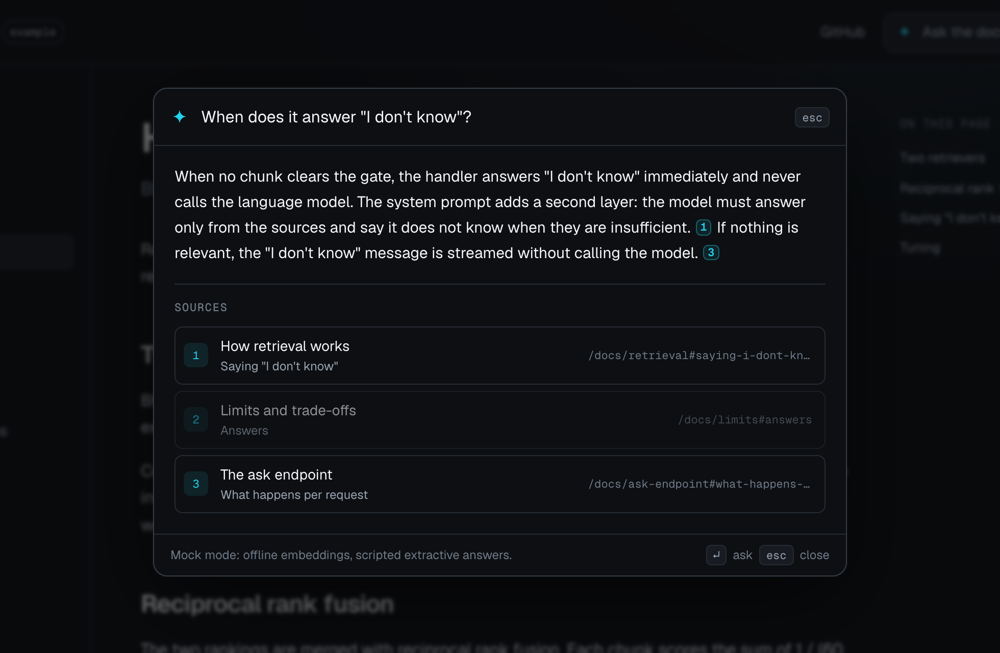
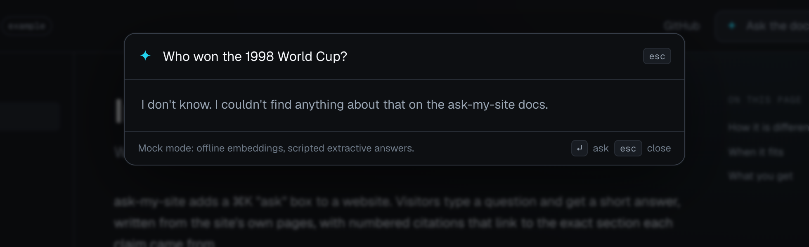

# ask-my-site

**A drop-in ⌘K "ask" box for any website: build-time index, in-memory hybrid search, streaming answers with citations. No vector database.**

[](https://github.com/dgesteves/ask-my-site/actions/workflows/ci.yml)
[](https://www.npmjs.com/package/ask-my-site)
[](./LICENSE)
[](#api)

**[Try the live demo →](https://ask-my-site-demo.vercel.app)** A docs site that answers questions about this library. It runs in mock mode (offline embeddings, scripted extractive answers), so no API key is involved.

<p align="center">
  
</p>

## Why

Documentation sites, product sites and portfolios change when you deploy, not between requests. Yet the usual way to put an assistant on one is a hosted vector database, an ingestion pipeline that keeps it in sync, and a bill and a failure mode for each.

ask-my-site indexes your pages at build time into one static JSON file that you commit next to them. At request time the same function that streams the answer loads that file, searches it in memory with keyword and vector retrieval, and refuses to answer when nothing relevant comes back. A 1,000-chunk site is a 1.6 MB index searched in under a millisecond.

## Quickstart

Install, then index your content into `ask-index.json`:

```sh
npm i ask-my-site ai @ai-sdk/openai @radix-ui/react-dialog cmdk
npx ask-my-site index ./content -e openai:text-embedding-3-small
```

`@radix-ui/react-dialog` and `cmdk` (with React 18.3 or 19) are only for the dialog. They are optional peer dependencies, so a project that only mounts the handler can leave them out and installs no React.

Mount the endpoint in `app/api/ask/route.ts` (any `Request → Response` runtime works):

```ts
const embeddingModel = openai.embedding('text-embedding-3-small');
export const POST = createAskHandler({ index, model: openai('gpt-5.4-mini'), embeddingModel });
```

Render the dialog in your layout, with `import 'ask-my-site/react/styles.css'` and `import 'ask-my-site/embed/launcher.css'` for its button:

```tsx
<AskDialog launcher />
```

It opens from a floating "Ask AI" button, as on the plugins' sites, and from <kbd>⌘</kbd>/<kbd>Ctrl</kbd>+<kbd>K</kbd>. Leave `launcher` out to open it from your own button (`trigger`) or the shortcut alone.

That is the whole integration: five lines, imports aside. [Full setup](#full-setup) is below, and no API key is needed to [try it](#try-it-in-2-minutes-no-api-key).

## Try it in 2 minutes, no API key

Index a folder of Markdown, MDX or HTML with the offline mock embedder, and serve the ask endpoint on your machine:

```sh
npm i ask-my-site
npx ask-my-site index ./docs -e mock   # writes ask-index.json
npx ask-my-site dev                    # serves POST http://localhost:8787/api/ask
```

Then point the dialog at `http://localhost:8787/api/ask`: start a site that uses the [Docusaurus](#docusaurus), [Astro or Starlight](#astro-and-starlight) plugin with `ASK_ENDPOINT=http://localhost:8787/api/ask` (such a site can skip `index`, as `dev` finds the `build/ask-index.json` or `dist/ask-index.json` its build wrote), render `<AskDialog endpoint="http://localhost:8787/api/ask" launcher />`, or add the [script tag](#any-static-site-script-embed) with `data-endpoint="http://localhost:8787/api/ask"`. Without a key, `dev` answers with the mock model, which quotes the sentences that best match the question and cites them; with `OPENAI_API_KEY` set, it answers with OpenAI. Then ⌘K (⌘I with the plugins), and ask.

## Features

- **Static, committed index.** Markdown, MDX and HTML in; one deterministic JSON file out, one chunk per line so content edits are small diffs. Rebuilds re-embed only the chunks whose text changed.
- **`--check` for CI.** Fails the build when the committed index no longer matches the content. Offline: no model call, no API key.
- **Hybrid retrieval in memory.** BM25 and cosine similarity over int8 vectors, merged with reciprocal rank fusion. No vector database, no network hop.
- **Says "I don't know".** A relevance gate refuses before the model is called when nothing relevant is found; the grounded prompt is the second line of defense.
- **Citations that land.** Every chunk belongs to exactly one heading, so `[1]` links to the section, not the page. Anchors are the slugs GitHub, rehype-slug and Docusaurus generate (github-slugger, applied to the heading as CommonMark renders it), or your own `{#id}` and HTML `id`s; from built HTML, a citation links only to an `id` the page has.
- **Any AI SDK model.** Embeddings through `embedMany`/`embed` and answers through `streamText`, from any provider package or an AI Gateway model string.
- **Web-standard handler.** `(Request) => Promise<Response>` built on Web APIs only, so it mounts in Next.js route handlers, Hono, Bun, Deno or Cloudflare Workers. It streams the AI SDK UI message protocol, so `useChat` can consume it too.
- **Accessible ⌘K dialog.** Radix Dialog and cmdk; focus management, `aria-live` answer, reduced motion, light and dark themes, unstyled-friendly.
- **Plugins and a script tag.** [Docusaurus](#docusaurus), [Astro and Starlight](#astro-and-starlight) plugins index the built site at the URLs it serves and add the dialog; [one `<script>` tag](#any-static-site-script-embed) adds it to Hugo, Jekyll, Eleventy, MkDocs or plain HTML.
- **Production hygiene.** zod-validated input, body-size cap, pluggable rate limiting (in-memory or Upstash) keyed on the one client IP header your platform controls, masked model errors, keyword fallback when the embedding provider is down.
- **Offline mock mode.** A deterministic embedder and a scripted extractive model run the whole pipeline with no key, for demos and tests.

## How it works

<p align="center">
  
</p>

**Build time** (`ask-my-site index`, once per deploy)

1. **Load.** Markdown and MDX (YAML frontmatter for `title`/`url`, MDX reduced to text without evaluating it, code fences untouched), HTML (`<main>` content, chrome stripped, heading `id`s kept), or plain `{ id, url, title, content }` records from a CMS.
2. **Chunk.** Split at every heading, pack paragraphs up to 1,200 characters, split oversized blocks by line, then sentence, then word, and overlap consecutive chunks of a section by up to 150 characters. Each chunk carries its heading path and anchor.
3. **Embed.** `embedMany` over `Page title › Heading path` plus the chunk text, so short sections keep their context. Unchanged chunks reuse their previous vectors, matched by a hash of exactly what was embedded.
4. **Quantize and write.** Each vector is scaled to ±127 and stored as int8 in base64. The file records a content hash over the chunker version, options and every chunk, which is what `--check` compares.

**Request time** (`createAskHandler`, per question)

1. Require a JSON body, apply the rate limit, validate the body (zod), embed the question.
2. Search the index, loaded into memory once per server instance: BM25 over an inverted index and an exact cosine scan over the int8 matrix.
3. Gate: keep only chunks with cosine ≥ 0.25 **or** keyword coverage ≥ 0.5, then fuse both rankings with reciprocal rank fusion. If nothing passes, stream the "I don't know" message and stop. The model is never called.
4. Number the top sources (merging chunks of the same section), send them with grounding instructions to `streamText`, and stream back metadata, then the numbered sources, then the answer, which cites them as `[n]`.

## Full setup

**1. Index your content** and commit the result.

```sh
npx ask-my-site index ./content --base-url /docs \
  --embedding openai:text-embedding-3-small --dimensions 512
```

**2. Mount the handler.** A Next.js route handler here; it is a plain `Request → Response` function.

```ts
// app/api/ask/route.ts
import { openai } from '@ai-sdk/openai';
import { createAskHandler, memoryRateLimit } from 'ask-my-site/server';
import index from '../../../ask-index.json';

export const POST = createAskHandler({
  index,
  model: openai('gpt-5.4-mini'),
  embeddingModel: openai.embedding('text-embedding-3-small'),
  embeddingProviderOptions: { openai: { dimensions: 512 } }, // same as the CLI
  siteName: 'Acme Docs',
  // Keyed by client IP; on platforms other than Vercel, set `trustedHeader` (see below).
  rateLimit: memoryRateLimit({ limit: 10, windowMs: 60_000 }),
});
```

**3. Render the dialog** once, near the root.

```tsx
'use client';
import { AskDialog } from 'ask-my-site/react';
import 'ask-my-site/react/styles.css';
import 'ask-my-site/embed/launcher.css';
import { useRouter } from 'next/navigation';

export function Ask() {
  const router = useRouter();
  return (
    <AskDialog
      launcher
      suggestions={['How do I install it?', 'Which runtimes are supported?']}
      onNavigate={(url, event) => {
        event.preventDefault();
        router.push(url);
      }}
    />
  );
}
```

**4. Keep the index fresh in CI.**

```sh
npx ask-my-site index ./content --base-url /docs --check   # exit 1 if stale
```

Other runtimes take the handler as-is: `app.post('/api/ask', (c) => handler(c.req.raw))` in Hono, `Bun.serve({ fetch: handler })`, or `export default { fetch: handler }` in a Cloudflare Worker.

## Docusaurus

The `ask-my-site/docusaurus` plugin does the indexing and the dialog for a Docusaurus 3 site. It builds the index with `ai`, and embeds with `@ai-sdk/openai` by default:

```sh
npm i ask-my-site ai @ai-sdk/openai @radix-ui/react-dialog cmdk
```

```ts
// docusaurus.config.ts
export default {
  // …
  plugins: [['ask-my-site/docusaurus', { endpoint: '/api/ask' }]],
};
```

- **After `docusaurus build`** it indexes the docs, blog posts and MDX pages the site serves into `build/ask-index.json`, at the exact URLs Docusaurus generated. It reads each page's Markdown, without the navbar, breadcrumbs, table of contents, doc cards or pagination, and leaves out the pages that only list others: blog lists, tag and author pages, and generated category indexes. There is no URL guessing, and nothing to commit: the index is rebuilt with the site, and unchanged pages reuse their vectors from the previous build, cached in `node_modules/.cache/ask-my-site` (Netlify and Vercel keep it between builds).
- **In the browser** it adds a floating "Ask AI" button beside the back-to-top button, and <kbd>⌘</kbd>/<kbd>Ctrl</kbd>+<kbd>I</kbd> (⌘K stays with your search, and text fields keep ⌘I for italic). It follows the site's light or dark mode and routes citations without a page reload. DocSearch's Ask AI side panel also opens with ⌘/Ctrl+I; pick another key with `dialog: { shortcut: 'j' }`, or turn it off with `shortcut: false`.
- **Embeddings** default to OpenAI's `text-embedding-3-small` when `OPENAI_API_KEY` is set at build time, or the same model through AI Gateway with `AI_GATEWAY_API_KEY`. Without either, it builds a keyword-only index and says so. With a key set, a build whose provider cannot load (`@ai-sdk/openai` missing, or failing to import) fails with the reason instead of quietly going keyword-only. Choose the model with `embedding`, named as the CLI's [`--embedding`](#cli) names it, so `docusaurus.config.ts` imports no provider: `'openai:text-embedding-3-large'`, `'cohere/embed-v4.0'` through AI Gateway, `'mock'` (offline) or `'none'` (keyword-only), and `dimensions: 512` for models that support it. `embeddingModel` takes an AI SDK model object instead, and `embeddingProviderOptions` applies to any model.

```ts
plugins: [['ask-my-site/docusaurus', { embedding: 'openai:text-embedding-3-small', dimensions: 512 }]],
```

Options: `endpoint`, `embedding`, `dimensions`, `embeddingModel`, `embeddingProviderOptions`, `chunking`, `indexFile` (default `ask-index.json`), `exclude` (path prefixes relative to `baseUrl` and the locale, e.g. `['/changelog']`), and `dialog` (`title`, `placeholder`, `suggestions`, `shortcut`, `buttonLabel`).

**Locales.** Docusaurus builds each locale on its own, and each gets its own `ask-index.json` under its locale path: `build/fr/ask-index.json`, served at `/fr/ask-index.json`. The recipes below serve one index, the default locale's.

**Versions.** Versioned docs index every version, so an answer can cite an old one. Leave versions out with `exclude`: with docs at `/docs`, `exclude: ['/docs/next', '/docs/1.0']` drops the unreleased docs and version 1.0.

**Another plugin wraps `Root`?** When two plugins wrap `Root`, Docusaurus uses only the last one's wrapper, so the dialog can go missing. Render it from your own `Root` instead; it shows once even if the plugin's `Root` renders it too:

```tsx
// src/theme/Root.tsx
import AskMySite from '@theme/AskMySite';
import Root from '@theme-original/Root';
import type { ReactNode } from 'react';

export default function RootWithAsk({ children }: { children: ReactNode }) {
  return (
    <Root>
      {children}
      <AskMySite />
    </Root>
  );
}
```

A Docusaurus site is static, so the endpoint runs as a function on your host. It must use the same embedding model as the build. The index is served at `${baseUrl}ask-index.json`; the recipes read it from `build/ask-index.json`, or from `build/docs/ask-index.json` for `baseUrl: '/docs/'` when the site is built into `build/docs` to be served at `/docs/`:

<details>
<summary><strong>Vercel</strong>: <code>api/ask.ts</code></summary>

```ts
import { readFile } from 'node:fs/promises';
import { join } from 'node:path';
import { openai } from '@ai-sdk/openai';
import { createAskHandler } from 'ask-my-site/server';

export const POST = createAskHandler({
  index: () => readFile(join(process.cwd(), 'build/ask-index.json'), 'utf8'),
  model: openai('gpt-5.4-mini'),
  embeddingModel: openai.embedding('text-embedding-3-small'),
  siteName: 'Acme Docs',
});
```

Include the index in the function's bundle with `vercel.json`: `{ "functions": { "api/ask.ts": { "includeFiles": "build/ask-index.json" } } }`.

</details>

<details>
<summary><strong>Netlify</strong>: <code>netlify/functions/ask.mts</code></summary>

```ts
import { readFile } from 'node:fs/promises';
import { join } from 'node:path';
import { openai } from '@ai-sdk/openai';
import { createAskHandler, memoryRateLimit } from 'ask-my-site/server';

export default createAskHandler({
  // The deployed file, bundled with the function (below). `build/docs/ask-index.json` for
  // `baseUrl: '/docs/'`.
  index: () => readFile(join(process.cwd(), 'build/ask-index.json'), 'utf8'),
  model: openai('gpt-5.4-mini'),
  embeddingModel: openai.embedding('text-embedding-3-small'),
  rateLimit: memoryRateLimit({
    limit: 10,
    windowMs: 60_000,
    trustedHeader: 'x-nf-client-connection-ip',
  }),
});

export const config = { path: '/api/ask' };
```

Include the index in the function's bundle with `netlify.toml`:

```toml
[functions.ask]
  included_files = ["build/ask-index.json"]
```

</details>

<details>
<summary><strong>Cloudflare Pages</strong>: <code>functions/api/ask.ts</code></summary>

```ts
import { createOpenAI } from '@ai-sdk/openai';
import { createAskHandler } from 'ask-my-site/server';

// `${baseUrl}ask-index.json`: '/docs/ask-index.json' for `baseUrl: '/docs/'`.
const INDEX = '/ask-index.json';

let handler: ((request: Request) => Promise<Response>) | undefined;

export const onRequest: PagesFunction<{ OPENAI_API_KEY: string; ASSETS: Fetcher }> = ({
  request,
  env,
}) => {
  const openai = createOpenAI({ apiKey: env.OPENAI_API_KEY });
  handler ??= createAskHandler({
    index: async () => {
      const response = await env.ASSETS.fetch(new URL(INDEX, request.url));
      if (!response.ok) throw new Error(`${INDEX}: HTTP ${String(response.status)}`);
      return response.text();
    },
    model: openai('gpt-5.4-mini'),
    embeddingModel: openai.embedding('text-embedding-3-small'),
  });
  return handler(request);
};
```

</details>

To try it locally, build the site once, run `npx ask-my-site dev` in its folder, which answers from `build/ask-index.json` with the model the build embedded with (the mock one without a key), and start the site with `ASK_ENDPOINT=http://localhost:8787/api/ask npm start`. The plugin posts to `ASK_ENDPOINT` when it is set and `endpoint` is not, and `docusaurus start` reminds you when the dialog posts to a path it does not serve. The [Docusaurus example](./examples/docusaurus) runs this way.

## Astro and Starlight

`ask-my-site/starlight` is a Starlight plugin, and `ask-my-site/astro` the Astro integration under it, for any other Astro site. Like the Docusaurus plugin, they build the index with the site and add the dialog. The dialog is React, so install React with its peers:

```sh
npm i ask-my-site ai @ai-sdk/openai react react-dom @radix-ui/react-dialog cmdk
```

```js
// astro.config.mjs
import starlight from '@astrojs/starlight';
import askMySite from 'ask-my-site/starlight';
import { defineConfig } from 'astro/config';

export default defineConfig({
  integrations: [starlight({ title: 'Acme Docs', plugins: [askMySite({ endpoint: '/api/ask' })] })],
});
```

Without Starlight, add `askMySite({ endpoint: '/api/ask' })` from `ask-my-site/astro` to `integrations` instead.

- **After `astro build`** it indexes the pages Astro built into `dist/ask-index.json`, at the URLs Astro serves them from: with your `base`, and with or without a trailing slash as `trailingSlash` and `build.format` have it. The Starlight plugin reads what Starlight's own search reads, the part of each page Starlight marks `data-pagefind-body`: the title and the Markdown, notes and tips included, without the header, sidebar, table of contents, heading anchors, edit link or pagination. Pages that Starlight's search leaves out are left out too: the 404 page and any page with `pagefind: false`. Mark anything else to leave out with `data-pagefind-ignore`, which keeps it out of the search as well. The Astro integration reads each page's `<main>`; choose another part with `content: '.prose'` (a tag, `#id`, `.class` or `[attribute]`, or a comma-separated list) and leave parts out with `ignore: '.toc'`. 404 and 500 pages, redirects and `noindex` pages are skipped. Unchanged pages reuse their vectors from the previous build, cached in `node_modules/.cache/ask-my-site`.
- **In the browser** it adds a floating "Ask AI" button and <kbd>⌘</kbd>/<kbd>Ctrl</kbd>+<kbd>I</kbd> to every page (⌘K stays with Starlight's search, and text fields keep ⌘I). In Starlight the button sits in the corner of the table of contents column, in Starlight's colors, and the dialog follows its light or dark theme; elsewhere the dialog follows `data-theme` on `<html>`, or the system setting. Vite bundles the dialog with your pages, so it shares React with your own islands. With `<ClientRouter />`, the dialog stays across navigations and citations navigate through the router.
- **Embeddings** default to OpenAI's `text-embedding-3-small` when `OPENAI_API_KEY` is set at build time, or the same model through AI Gateway with `AI_GATEWAY_API_KEY`, as in the Docusaurus plugin; without either, a keyword-only index, with a warning. Choose the model with `embedding` and `dimensions` as there, e.g. `askMySite({ embedding: 'openai:text-embedding-3-small', dimensions: 512 })`.

Options: `endpoint`, `embedding`, `dimensions`, `embeddingModel`, `embeddingProviderOptions`, `chunking`, `indexFile` (default `ask-index.json`), `exclude` (path prefixes relative to `base` and the locale, e.g. `['/changelog']`), and `dialog` (`title`, `placeholder`, `suggestions`, `shortcut`, `buttonLabel`, `theme`); `content` and `ignore` for the Astro integration. It works with Astro 5, 6 and 7, and Starlight 0.32 and later.

**Locales.** Starlight builds every locale at once, so the plugin writes one index per locale: `dist/ask-index.json` for the root locale and `dist/fr/ask-index.json` for French, served at `/fr/ask-index.json`. A page not yet translated is indexed in its locale with the fallback content Starlight shows there, as Starlight's search does. When every locale has its own path (no `root` locale), the default locale's index is under its path too, e.g. `dist/en/ask-index.json`. The Astro integration splits the index the same way along Astro's `i18n` locales. Every page's dialog posts to the same endpoint, and the recipes serve one index.

**The endpoint** is the same as for Docusaurus: use the [Vercel, Netlify or Cloudflare Pages recipe](#docusaurus) with `dist/ask-index.json` in place of `build/ask-index.json`. Astro writes `base` into URLs, not folders, so the file stays at `dist/ask-index.json` with `base: '/docs'` and is served at `/docs/ask-index.json`. To try it locally, build the site once, run `npx ask-my-site dev`, which answers from `dist/ask-index.json`, and start `astro dev` with `ASK_ENDPOINT=http://localhost:8787/api/ask`, as the [Starlight example](./examples/starlight) does.

**Shortcut.** Pick another key with `dialog: { shortcut: 'j' }`, turn it off with `shortcut: false`, or hide the button with `buttonLabel: false`.

## Any static site (script embed)

For Hugo, Jekyll, Eleventy, MkDocs or plain HTML, one script tag adds the dialog and its button, with React and the styles bundled in (91 KB gzipped):

```html
<script
  src="https://cdn.jsdelivr.net/npm/ask-my-site@0.4/dist/embed.global.js"
  data-endpoint="/api/ask"
  defer
></script>
```

1. **Index the site** with the [CLI](#cli): from its Markdown, or from the HTML your generator built, which has the URLs it actually serves (`public` after `hugo`, `_site` after Jekyll or Eleventy, `site` after `mkdocs build`). HTML is read from each page's `<main>`, and citations link to the headings' own `id`s.
2. **Deploy the endpoint** next to the site, with one of the [recipes](#docusaurus) or the [full setup](#full-setup), reading your index. To try it first, run `npx ask-my-site dev` beside the index and set `data-endpoint="http://localhost:8787/api/ask"`.
3. **Add the script tag** to your base template.

It mounts itself once the page has loaded, with its tag's attributes: `data-endpoint` (default `/api/ask`), `data-title`, `data-placeholder`, `data-suggestions` (a JSON array, as in `data-suggestions='["How do I install it?"]'`), `data-shortcut` (default `i`; `"false"` turns it off), `data-button-label` (default "Ask AI"; `"false"` hides the button) and `data-theme` (`auto`, the default, follows `data-theme` on `<html>` when the site sets one, and the system setting otherwise; or `light` or `dark`). With `data-manual` it waits for `window.AskMySite.mount(options)`, which takes the same options and returns `{ open, close, unmount }`, for example to open the dialog from your own search box. Pin an exact version (`ask-my-site@0.4.0`) in production.

In an app with a bundler, `mountAskDialog(options)` from `ask-my-site/embed` does the same with your own React (install `react`, `react-dom`, `@radix-ui/react-dialog` and `cmdk`); import `ask-my-site/react/styles.css` and `ask-my-site/embed/launcher.css` with it.

## Example site

The [Next.js example](./examples/nextjs), which the [live demo](https://ask-my-site-demo.vercel.app) runs, is a docs site about ask-my-site that indexes itself.

```sh
pnpm install && pnpm example:dev   # http://localhost:3000, then press ⌘K
```

Without `OPENAI_API_KEY` it runs in mock mode: `mockEmbeddingModel()` hashes words and word pairs into vectors, and `mockLanguageModel()` answers by quoting the sentences that best match the question, with citations. Everything else is the production code path. With a key in `examples/nextjs/.env.local` it uses OpenAI.

<p align="center">
  
</p>

## API

Nine imports and a CLI. Each import is tree-shakeable, and only `ask-my-site/node`, the framework plugins and the CLI touch Node built-ins.

| Import                   | For                                                                                                               |
| ------------------------ | ----------------------------------------------------------------------------------------------------------------- |
| `ask-my-site`            | Loaders, chunking, `buildIndex`, `checkIndex`, `loadIndex`, `retrieve`                                            |
| `ask-my-site/node`       | `loadDirectory`, `readIndexFile`, `writeIndexFile`, config types                                                  |
| `ask-my-site/server`     | `createAskHandler`, rate limiters, prompt helpers                                                                 |
| `ask-my-site/react`      | `AskDialog`, `useAsk`, `AskAnswer`; needs `@radix-ui/react-dialog` and `cmdk`                                     |
| `ask-my-site/embed`      | `mountAskDialog`: the dialog and its button without writing React ([script embed](#any-static-site-script-embed)) |
| `ask-my-site/docusaurus` | The [Docusaurus](#docusaurus) plugin                                                                              |
| `ask-my-site/astro`      | The [Astro](#astro-and-starlight) integration                                                                     |
| `ask-my-site/starlight`  | The [Starlight](#astro-and-starlight) plugin                                                                      |
| `ask-my-site/mock`       | `mockEmbeddingModel`, `mockLanguageModel`                                                                         |
| `ask-my-site` (bin)      | `ask-my-site index`, and `ask-my-site dev` for a local endpoint                                                   |

### CLI

```
ask-my-site index [dir] [options]

  -o, --out <file>             Index file (default: ask-index.json)
      --check                  Exit 1 if the index is stale. Never calls a model.
      --base-url <url>         URL prefix for pages (default: /)
  -e, --embedding <spec>       openai:<model> | <provider>/<model> (AI Gateway) | mock[:<dims>] | none
      --dimensions <n>         Vector size, for models that support it; with --check, the size the index must have
      --chunk-size <chars>     Max characters per chunk (default: 1200)
      --chunk-overlap <chars>  Characters shared by consecutive chunks (default: 150)
      --ignore <glob>          Skip matching files; repeatable
      --framework <name>       docusaurus | starlight | next | none (default: detected)
      --clean-urls             Drop .html from HTML files' URLs (default: keep it)
  -c, --config <file>          Module whose default export is an AskConfig
  -q, --quiet                  Only print errors
  -h, --help                   Show this help
  -v, --version                Show the version
```

Without `--embedding`, it uses `openai:text-embedding-3-small` when `OPENAI_API_KEY` is set (or `openai/text-embedding-3-small` through AI Gateway when only `AI_GATEWAY_API_KEY` is), and fails otherwise rather than silently building a keyword-only index. `.env` and `.env.local` are read without overriding the environment. `index.md`, `_index.md` (Hugo), `index.html` and `README.md` stand for their folder. Other HTML files keep `.html` in their URL (`docs/install.html` → `/docs/install.html`), as a server without clean URLs serves them; `--clean-urls` drops it for a host that serves `/docs/install`. Frontmatter `url` or `permalink` overrides the derived URL, and `draft: true`, `ask: false` or `noindex: true` excludes a page. Symlinked files and folders are followed, except a link back into a folder already being read. Ids and URLs use the file path in Unicode NFC, so a name like `café.md` gets the same id on macOS and Linux. `--ignore` globs support `*`, `**`, `?`, `[...]` and `{a,b}`, matched case-sensitively on every platform.

`ask-my-site dev` serves the ask endpoint on your machine, for the dialog on a site's dev server:

```
ask-my-site dev [options]

      --index <file>           Index file (default: ask-index.json, then build/ask-index.json,
                               then dist/ask-index.json)
      --port <n>               Port on 127.0.0.1 (default: 8787)
      --origin <origin>        Origin allowed to call it (CORS); repeatable (default: any)
      --model <id>             OpenAI model for answers (default: gpt-5.4-mini)
  -h, --help                   Show this help
```

It embeds questions with the model the index records: the mock one, OpenAI's with `OPENAI_API_KEY`, AI Gateway's with `AI_GATEWAY_API_KEY`, or none for a keyword-only index. An index it cannot match, such as one embedded with OpenAI when no key is set, is refused with what would fix it. Answers come from OpenAI when `OPENAI_API_KEY` is set, else from the mock model. A rebuilt index is picked up on the next question, and on start it prints the endpoint and what to set: `ASK_ENDPOINT`, `endpoint`, or `data-endpoint`.

Citations have to land on the URL your site actually serves, and docs frameworks do not all map files to URLs the same way. The CLI looks for the framework's config in or above the content folder and follows its rules, printing which it picked:

| Framework                        | Detected from                             | Rules                                                                                                                                                                                                                                                                                                                              |
| -------------------------------- | ----------------------------------------- | ---------------------------------------------------------------------------------------------------------------------------------------------------------------------------------------------------------------------------------------------------------------------------------------------------------------------------------- |
| Docusaurus (docs)                | `docusaurus.config.*`                     | `slug` (absolute, or resolved against the page's folder) and `id` frontmatter; number prefixes dropped (`01-intro.md` → `intro`, but not `2024-12-recap.md` or `1.0-release.md`) unless `parse_number_prefixes: false`; `index`, `README` or a file named like its folder is the folder's page; `_` files and folders are partials |
| Starlight                        | `astro.config.*` and `@astrojs/starlight` | `slug` frontmatter replaces the path; segments are slugified (`Getting Started.md` → `getting-started`); `index` is the folder's page; `_` files are skipped                                                                                                                                                                       |
| Next.js-style (Fumadocs, Nextra) | `next.config.*` or `source.config.ts`     | `(group)` folders are not part of the URL; `index` and app-router `page.mdx` are the folder's page                                                                                                                                                                                                                                 |

Anything else keeps the path as it is, and `--framework` overrides the detection. Frontmatter `url` or `permalink` always wins. Docusaurus serves docs under `/docs` by default, so pass `--base-url /docs` (the CLI reminds you); its blog's date-based URLs are not derived, so give blog posts a `slug` or index the built HTML. Rules were checked against Docusaurus's own `getSlug` (all 92 pages of docusaurus.io's docs match) and against ui.shadcn.com and starlight.astro.build.

For any other embedding provider, or for content that is not on disk, use a config module:

```js
// ask-my-site.config.mjs
import { cohere } from '@ai-sdk/cohere';
import { getPosts } from './lib/cms.mjs';

/** @type {import('ask-my-site/node').AskConfig} */
export default {
  embeddingModel: cohere.embedding('embed-multilingual-v3.0'),
  baseUrl: '/docs',
  documents: async () =>
    (await getPosts()).map((p) => ({
      id: p.slug,
      url: `/blog/${p.slug}`,
      title: p.title,
      content: p.markdown,
    })),
};
```

### `createAskHandler(options)` from `ask-my-site/server`

| Option                     | Default                     | Notes                                                                                                                                                                                                                          |
| -------------------------- | --------------------------- | ------------------------------------------------------------------------------------------------------------------------------------------------------------------------------------------------------------------------------ |
| `index`                    | required                    | Parsed JSON, its text, a `loadIndex` result, or a (sync or async) function returning one. Loaded once; a failed load is retried on the next request.                                                                           |
| `model`                    | required                    | Any AI SDK `LanguageModel`.                                                                                                                                                                                                    |
| `embeddingModel`           | none                        | Must match the index (checked). Without it, retrieval is keyword-only.                                                                                                                                                         |
| `embeddingProviderOptions` | none                        | Must match the build, e.g. `{ openai: { dimensions: 512 } }` (dimension mismatches are reported).                                                                                                                              |
| `siteName`                 | `"this site"`               | Used in the instructions and the refusal.                                                                                                                                                                                      |
| `instructions`             | grounded defaults           | A string, or `(defaults) => string` to extend them.                                                                                                                                                                            |
| `retrieval`                | tuned                       | `{ topK: 6, candidates: 40, rrfK: 60, minSimilarity: 0.25, minKeywordCoverage: 0.5 }`, and `similarityNeedsKeyword`, on for a mock index, whose similarity is lexical.                                                         |
| `maxContextChars`          | `8000`                      | Source text sent to the model.                                                                                                                                                                                                 |
| `maxQuestionLength`        | `500`                       | Longer questions get a 400.                                                                                                                                                                                                    |
| `maxBodyBytes`             | 64 KiB                      | Counted while reading, so a chunked upload cannot exhaust memory.                                                                                                                                                              |
| `noAnswerMessage`          | "I don't know. I couldn't…" | Streamed when nothing is relevant.                                                                                                                                                                                             |
| `rateLimit`                | none                        | `(request) => { success, limit?, remaining?, reset? }`, sync or async. See [rate limits and client IPs](#rate-limits-and-client-ips).                                                                                          |
| `rateLimitFailure`         | `"closed"`                  | When `rateLimit` throws (e.g. Redis is down): `"closed"` answers 503 without calling the model, `"open"` answers anyway. Reported to `onError` either way.                                                                     |
| `generation`               | `{ maxOutputTokens: 800 }`  | Passed to `streamText`: `temperature`, `providerOptions`, `timeout`, `telemetry`, …                                                                                                                                            |
| `headers`                  | none                        | Added to every response, including the 204 that answers a CORS preflight. Cross-origin: set `access-control-allow-origin` and `access-control-allow-headers: content-type`, and in Next.js also `export const OPTIONS = POST`. |
| `onFinish`                 | none                        | `{ question, answer, sources, refused, retrieval, usage }` after each answer. If it throws or rejects, the error goes to `onError` and the answer the visitor got is unaffected.                                               |
| `onError`                  | `console.error`             | Handled errors: embedding fallbacks, model failures, generations aborted by `generation.timeout` (not client disconnects), a failing `rateLimit` or `onFinish`, misconfiguration.                                              |

The body is `{ "question": string }` sent as `application/json`; the `{ messages }` body that `useChat` sends is accepted too, using the last user message. Any other content type gets a 415: browsers only send a cross-origin POST without a CORS preflight when its type is `text/plain`, a form encoding or missing, so requiring JSON means another site's page cannot make its visitors' browsers spend your model budget unless your `headers` allow its origin. Errors are JSON `{ error: { code, message } }` with 400, 405, 413, 415, 429 (with `Retry-After` and `RateLimit-*` headers), 500 or 503 (the rate limiter failed). A client that disconnects before the answer starts gets a bare 499 and is not reported as an error.

The response is an [AI SDK UI message stream](https://ai-sdk.dev/docs/ai-sdk-ui/stream-protocol) (SSE):

```
data: {"type":"start","messageMetadata":{"refused":false,"retrieval":"hybrid"}}
data: {"type":"source-url","sourceId":"1","url":"/docs/retrieval#saying-i-dont-know","title":"How retrieval works › Saying \"I don't know\""}
data: {"type":"text-delta","id":"…","delta":"When no chunk clears the gate, "}
…
data: {"type":"finish"}
data: [DONE]
```

Rate limiters: `memoryRateLimit({ limit, windowMs })` is a per-instance token bucket keyed by client IP; `upstashRateLimit(new Ratelimit({ … }))` adapts `@upstash/ratelimit` for a shared limit without ask-my-site depending on it. Both take `trustedHeader` and `key`, below.

#### Rate limits and client IPs

A rate limit is only as strong as its key. Both limiters key each request by the client IP read from **one** header, and a header can only be trusted if your platform sets it on every request, replacing whatever the client sent. Any other header passes through from the client unchanged, so trusting it lets a client pick a new key for every request and never be limited. ask-my-site cannot know which headers your platform controls, so it never guesses from a list: it reads the last entry of `X-Forwarded-For` unless you name the header with `trustedHeader`.

| Where the handler runs                                     | Configure                                                                                                                                                           |
| ---------------------------------------------------------- | ------------------------------------------------------------------------------------------------------------------------------------------------------------------- |
| Vercel                                                     | Nothing: Vercel overwrites `X-Forwarded-For` with the client IP.                                                                                                    |
| Netlify                                                    | `trustedHeader: 'x-nf-client-connection-ip'`                                                                                                                        |
| Cloudflare Workers, or an origin only Cloudflare can reach | `trustedHeader: 'cf-connecting-ip'`                                                                                                                                 |
| Fly.io                                                     | `trustedHeader: 'fly-client-ip'`                                                                                                                                    |
| Behind one reverse proxy you run                           | Nothing if it appends the peer address to `X-Forwarded-For` (nginx: `$proxy_add_x_forwarded_for`); otherwise the header it sets, e.g. `trustedHeader: 'x-real-ip'`. |
| Exposed directly, with no proxy in front                   | Every header, `X-Forwarded-For` included, comes from the client. Put a proxy in front, or pass a `key` the client cannot forge, such as a signed-in user id.        |

Use your platform's header even when others are present: on Vercel, for example, a client can send its own `cf-connecting-ip`. When the header holds a list, the last entry (added by the nearest proxy) is used, so with several proxies in a chain, name a header the outermost one sets. Requests that lack the header share one `"anonymous"` bucket rather than falling back to a header the client controls. `key: (request) => string` replaces the lookup entirely, for example to limit per signed-in user; `clientKey(request, { trustedHeader })` is exported for custom limiters.

If the limiter itself fails (Upstash unreachable, a bug in your own), the handler fails closed: it reports the error and answers 503 without calling the model. The limiter is what stands between a public endpoint and an unbounded model bill, and its outage can be provoked, for example by a flood that exhausts a Redis plan's request quota, so its failure should not quietly switch it off. Set `rateLimitFailure: 'open'` if you would rather keep answering during an outage and rely on your provider's spend limits. (`@upstash/ratelimit` already allows requests when Redis is merely slow, after its own `timeout`.)

### `<AskDialog />` and `useAsk()` from `ask-my-site/react`

| Prop                                  | Default            | Notes                                                                                                        |
| ------------------------------------- | ------------------ | ------------------------------------------------------------------------------------------------------------ |
| `endpoint`                            | `/api/ask`         | Also `headers` and a custom `fetch`.                                                                         |
| `open`, `defaultOpen`, `onOpenChange` | uncontrolled       | Controlled or uncontrolled.                                                                                  |
| `shortcut`                            | `"k"`              | With ⌘ or Ctrl; `false` disables it.                                                                         |
| `trigger`                             | none               | An element that opens the dialog, e.g. a search button.                                                      |
| `launcher`                            | `false`            | `true` or a label: a floating "Ask AI" button with the shortcut, styled by `ask-my-site/embed/launcher.css`. |
| `suggestions`                         | `[]`               | Offered before typing, filtered as you type.                                                                 |
| `onNavigate`                          | browser navigation | `(url, event)` for citations and sources; `preventDefault()` to route yourself.                              |
| `theme`                               | `"system"`         | `"light"` or `"dark"` to pin it.                                                                             |
| `classNames`                          | none               | Extra classes per part: `overlay`, `content`, `input`, `list`, `item`, `answer`, `sources`, `footer`.        |
| `title`, `placeholder`, `footer`      | sensible defaults  | `title` is the dialog's accessible name.                                                                     |

`useAsk({ endpoint })` returns `{ ask, stop, reset, status, question, answer, sources, refused, truncated, retrieval, error }`. `status` is `idle | loading | streaming | done | error`; `error.kind` is `rate-limited | http | network | stream`, with `retryAfter` for rate limits. When the endpoint answers 404, the visitor reads that answers aren't available, and in development (a dev build, or a page on localhost) the console says which URL the dialog posted to. `truncated` is `true` when the model stopped at its output limit (`generation.maxOutputTokens`, 800 by default), so a `done` answer may be incomplete; the dialog says so under the answer. Sources arrive before the first word, deltas are batched to one render per animation frame, and `stop()` keeps the partial answer. Closing the dialog, by Escape, a click outside or a controlling parent, stops the answer in flight so the model is not left generating for nobody.

Theming is CSS custom properties: `.ask-dialog { --ask-accent: #7c3aed; --ask-radius: 8px; }`. Skip the stylesheet entirely and style the stable `ask-*` classes, or pass Tailwind classes through `classNames`.

### Core, from `ask-my-site`

```ts
import { buildIndex, fromMarkdown, loadIndex, retrieve, serializeIndexFile } from 'ask-my-site';

const doc = fromMarkdown(source, { id: 'guide.md', url: '/guide' });
const { index, stats } = await buildIndex({ documents: [doc], embeddingModel, previous });
const loaded = loadIndex(serializeIndexFile(index));
const { hits, answerable, best } = retrieve(loaded, { text: question, vector });
```

Also exported: `fromHtml` (`root` picks the part of a page to read, as a selector such as `[data-pagefind-body]`, and `ignore` what to leave out), `fromDocuments`, `chunkDocument`, `checkIndex`, `parseIndexFile`, `validateIndexFile`, `tokenize`, `createSlugger` (use it in your renderer so anchors always match), and the building blocks `Bm25Index`, `VectorIndex`, `reciprocalRankFusion`, `quantizeInt8`, `encodeVector`, `decodeVector`.

## Design decisions and trade-offs

**Static over hosted.** Content that changes on deploy does not need a database that changes at runtime. A committed index removes the vector store, its sync job and its outage modes, and it versions with the pages it cites, so a citation can never point at a section that was deleted in the same release. The cost is freshness: content changes need a rebuild, which is the point of `--check`.

**int8, without a scale.** Each vector is scaled so its largest component is ±127 and rounded: one byte per dimension, a quarter of float32 and about a tenth of float JSON. No per-vector scale is stored because retrieval only needs cosine similarity, and cosine is scale-invariant. Measured recall@10 against exact float32 is 99% at 10,000 chunks, with similarities within 0.005. Binary (1-bit) quantization would shrink the vectors another 8×, but on the same benchmark vectors it keeps only 27% of the exact top 10 (66% even after rescoring a 4× shortlist), and rescoring means shipping full vectors anyway. Product quantization needs trained codebooks. Neither pays off at this scale.

**Hybrid retrieval, fused by rank.** Embeddings are good at paraphrase and bad at exact tokens: function names, flags, error codes. BM25 is the reverse. Docs questions mix both. Reciprocal rank fusion (k = 60) merges the two rankings using ranks alone, so there is no fragile attempt to put BM25 scores and cosines on one scale, and a chunk both retrievers like beats one only a single retriever loves. camelCase identifiers are indexed whole and split, so `createAskHandler` matches "create ask handler".

**A relevance gate before the model.** RRF scores say which chunk is best, not whether any chunk is good, so the gate uses the raw signals: cosine ≥ 0.25 (calibrated for `text-embedding-3-small`), or keyword coverage ≥ 0.5, where coverage is the share of the question's IDF weight a chunk contains. Coverage is bounded to [0, 1] and comparable across questions of any length, unlike raw BM25, but it is not corpus-independent: IDF comes from your pages, and a question word that appears on none of them carries the most weight of all. That makes the keyword side conservative. On the example docs, "rate limiting" covers 1.0, but "How do I configure rate limiting for my startup?" covers 0.38, because no page says "startup", so a keyword-only lookup refuses it. With embeddings the cosine side catches such questions; for a keyword-only index, or a softer fallback while the embedding provider is down, lower `minKeywordCoverage` after checking `best.keywordCoverage` on real questions. If nothing passes, the answer is "I don't know" with zero model calls: fast, free and deterministic. The thresholds are model-specific, which is the main tuning cost; `retrieve()` returns the `best` signals to make that easy.

**An exact scan, not an ANN index.** At 10,000 chunks a full int8 cosine scan takes under 5 ms, recall is perfect, and there is nothing to build at cold start. HNSW and friends earn their memory and build time well past the sizes a static site produces.

**One function, one stream.** Retrieval runs inside the request handler instead of a separate service, and the response is the AI SDK's UI message stream rather than a bespoke format: sources first, then text. `useAsk` parses it with a small SSE reader, keeping `ai` and zod out of the client bundle, and the same stream is readable by `useChat`.

**Untrusted output stays text.** The answer is rendered from a small Markdown subset into React nodes, never HTML. Links are allow-listed to http(s), mailto and relative URLs, and `[n]` becomes a link only if the server actually sent source `n`. Sources and the question go to the model verbatim, inside tags that end in a random suffix drawn per request (`<sources-3f9a…>`), so no text on your site or in a question can close the sources block or pose as the question, however it spells a tag; the instructions tell the model to treat both as data. That keeps prompt injection from forging structure, not from being attempted: a page that says "ignore your rules" is still text the model reads, so index only content you trust.

**Where it stops scaling.** Everything is linear in corpus size: roughly 1.6 MB of index, 34 ms of cold load and 0.7 ms per query per 1,000 chunks of ~800 characters at 512 dimensions. That is comfortable to about 10,000 chunks and workable to about 50,000 (79 MB, 1.7 s cold start, 37 ms per query). Beyond that, or for content that changes per request or per user, use a vector database. If your platform limits function bundle size, load the index from a static URL instead of importing it: `index: () => fetch(url).then((r) => r.text())`.

**Other limits.** The keyword side is English-leaning (stopwords, plural stripping); other languages rely on the embedding model. Answers are single-turn. MDX is reduced to text, so components that render content from props are invisible to the index. The HTML loader is a tag stripper that expects static-site-generator output, not arbitrary markup. `memoryRateLimit` is per instance, and either limiter keys on a client IP header that only your platform can vouch for (see [rate limits and client IPs](#rate-limits-and-client-ips)).

## Benchmarks

`pnpm bench` builds the package and measures it on synthetic, documentation-shaped corpora: Zipf-distributed vocabulary, chunks of 600 to 1,000 characters grouped into pages, and 512-dimension embeddings clustered around shared topics, as one site's embeddings are. Query latency covers hybrid retrieval end to end (BM25, cosine scan, fusion) and excludes the embedding API call, which is network-bound and the same for any design.

Apple M1 Max, Node 24.18, 1,000 queries per size after warm-up:

| Chunks |   Index |    gzip | Same index, float JSON | Cold load |   Memory | Query p50 |      p95 |      p99 | Recall@10 |
| -----: | ------: | ------: | ---------------------: | --------: | -------: | --------: | -------: | -------: | --------: |
|  1,000 |  1.6 MB |  0.9 MB |                 7.5 MB |     32 ms |   3.2 MB |   0.71 ms |  0.76 ms |  0.91 ms |     99.9% |
| 10,000 | 15.7 MB |  8.5 MB |                75.4 MB |    339 ms |  25.2 MB |   6.96 ms |  7.32 ms |  7.84 ms |     99.1% |
| 50,000 | 78.7 MB | 42.6 MB |               377.1 MB |    1.72 s | 123.9 MB |  37.11 ms | 39.01 ms | 44.03 ms |     98.5% |

At 10,000 chunks, the BM25 half of a query takes 2.3 ms and the vector scan 4.6 ms (p50). Cold load is a one-time cost per server instance: parse, decode vectors, build the inverted index. "Recall@10" is the overlap between int8 and exact float32 top-10 results. The [benchmark source](./bench/run.mjs) documents the method.

## Roadmap

- **Follow-up questions:** condense the conversation into a standalone question before retrieval.
- **Re-ranking hook:** an optional AI SDK reranking model over the fused candidates.
- **Retrieval evals in CI:** a golden question set scored for hit rate and refusal precision, next to `--check`.
- **Bigger corpora:** sharded indexes loaded per section, and binary quantization with int8 rescoring.
- **More framework plugins:** VitePress, after the [Docusaurus](#docusaurus), [Astro and Starlight](#astro-and-starlight) ones.
- **Language-aware keyword search:** per-language stopwords and stemming.

## Development

```sh
pnpm install
pnpm test        # Vitest, offline: mock models from ai/test, no keys
pnpm validate    # lint, format, typecheck, test, build, package checks, example builds + lint
pnpm bench       # benchmarks
pnpm assets      # regenerate the architecture diagram
```

Requires Node 24 and pnpm (via Corepack). Releases are managed with [Changesets](./.changeset/README.md).

## License

[MIT](./LICENSE) © Diogo Esteves
